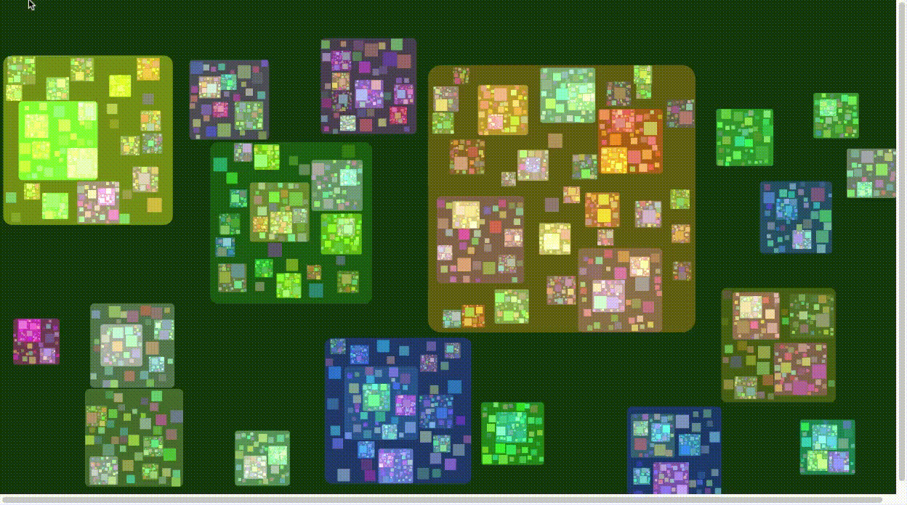

# Recursive Squares P5.JS

- Recursion is when a function calls itself until someone stops it. 
- If no one stops it then it'll recurse (call itself) forever.
- Recursive functions let you perform a unit of work multiple times.

